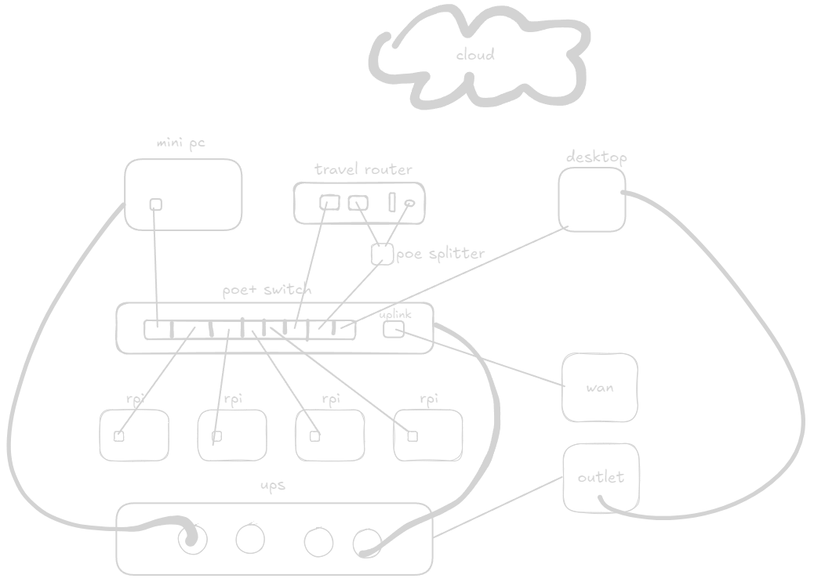

# Mini Rack

I've planned to build 10 inch mini rack for my home lab.
[This video](https://www.youtube.com/watch?v=y1GCIwLm3is) was the inspiration.

## Hardware

- [DeskPi RackMate T0](https://deskpi.com/products/deskpi-rackmate-t1-rackmount-10-inch-4u-server-cabinet-for-network-servers-audio-and-video-equipment), $79.99
- [Firebat Ak2 Plus](https://firebat.net/firebat-ak2-plus-minipc-intel-n100-dual-band-wifi5-bt4-2-16gb-512gb-desktop-gaming-computer-mini-pc-gamer/), $136.33, N100, 16GB, 1TB
- [Raspberry Pi 5 8GB](https://www.raspberrypi.com/products/raspberry-pi-5/), 14000
- [Suptronics X1012-V1.2](https://suptronics.com/Raspberrypi/Storage/x1012-v1.2.html), 31000, poe+(802.3at)
- [ipTIME PoE802]()
- [Gigabit Poe Splitter]()
- [GL-INet Beryl AX](), 150000
- [Server Tap HDSVAL-14]()
- [JetKVM]()

switch              80000
sata ssd 1tb       130000 -> 100000
raspberry pi 5 * 2 280000 -> 200000
hat * 2             70000
ssd 1tb * 2        180000
rack               160000
psu                 40000
router             150000
poe splitter        15000

## Software

